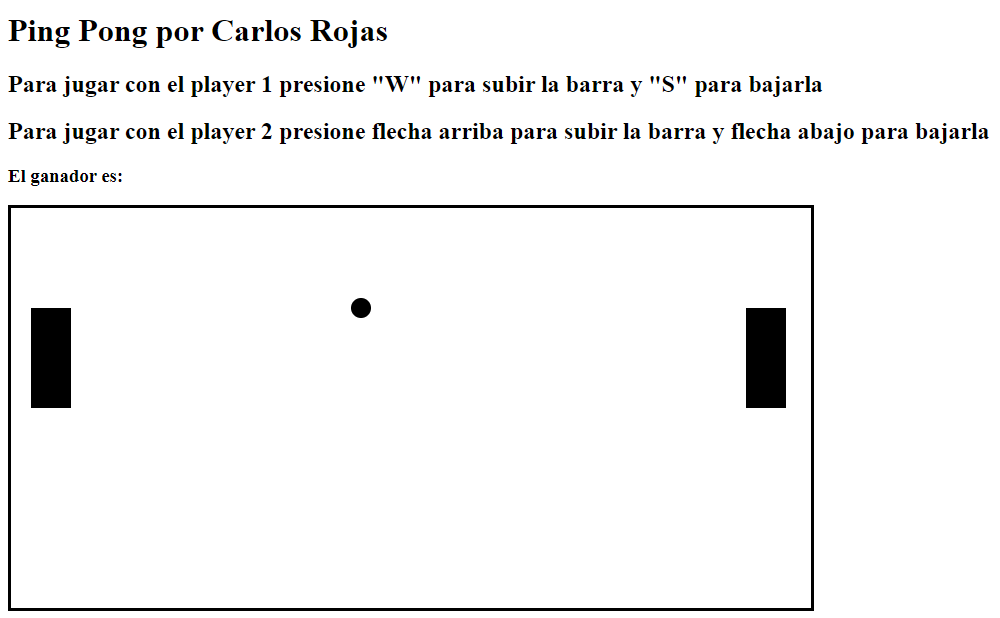

# Juego de Ping Pong

En este proyecto se pretende realizar un juego de Ping Pong para poner a prueba conocimientos como:

* Modelamiento de objetos aplicando Programación Orientada a Objetos (POO)
* Creación de entidades
* Buenas prácticas de programación en la contrucción del caso de negocio
* Uso de estilos de arquitectura como el MVC

Para esto se definen las siguientes secciones:
  1. [Configuración inicial](#configuración-inicial)
  2. [Reglas de juego](#reglas-de-juego)
  3. [Requerimientos](#requerimientos)
  4. [Preguntas](#preguntas)

## Configuración inicial

Para poder iniciar con el juego es necesario ubicar un servidor local como el Apache de XAMPP donde se pueda visualizar el archivo pong/index.html

Posteriormente en el navegador que esté usando se verán una serie de mensajes como los que se ven en la siguiente imagen (Esta prueba fue hecha desde Opera):

En ese momento se puede iniciar el juego. Te deseo mucha suerte!

## Reglas de juego

El juego inicia presionando la tecla "espacio", también se puede pausar el juego desde esta misma tecla siempre que se desee

El jugador 1 podrá mover su barra utilizando las teclas "W" para subir y "S" para bajar

El jugador 2 podrá mover su barra utilizando las teclas "flecha arriba" para subir y "flecha abajo" para bajar

La idea del juego es no dejar que la pelota llegue a los bordes del tablero, si esto pasa, perderá el jugador al que le corresponda el borde al que tocó la pelota

La pelota puede tocar los bordes superiores, esto la hará rebotar según el ángulo con el que choque, lo mismo pasa al colisionar con las barras

## Requerimientos

Para usar este proyecto solo es necesario contar con python 3.10 instalado en su computadora y tener algún tipo de interfaz para ejecutar comandos de terminal de su sistema operativo.

Para usar este proyecto es necesario tener algún IDE que permita el manejo de Javascript y HTML5, además de contar con un servidor web local como lo puede ser Apache

## Preguntas

A continuación se mostrarán algunas preguntas que fueron surgiendo a medida que se realizaba el programa y algunas respuestas

Por qué le da pausar a algo, tantas veces? R//: resulta que está pausando la grabación del video jejeje

Por que hace prototype para agregar un método en vez de ponerlo directamente en la clase? R//: para practicar el prototype

Por que usamos funciones anónimas en vez de definir las classes con la palabra clave "class"?

Por qué keyCode me sale tachado al utilizarlo?

Como se manejan las colisiones con los bordes superiores? R//: al modificar los ángulos con las funciones seno y coseno, podemos modificar las velocidades en las que cambian las posiciones X y Y de la pelota, y con ayuda del sentido podemos hacer que esta se mueva dependiendo de la colisión.